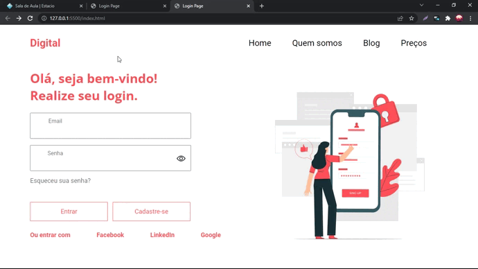

# Página de login
Projeto desenvolvido com o objetivo de aprender e aperfeiçoamento conhecimento de HTML e CSS.

## Descrição do Projeto

 Página de login feita primeiramente no figma, depois programada com HTML, CSS e JavaScript. 

# Projeto 

 Link:  https://danielresende23.github.io/Login-Page/ 

<h1 align="center">
  
  
 
 

</h1>

</h1>
