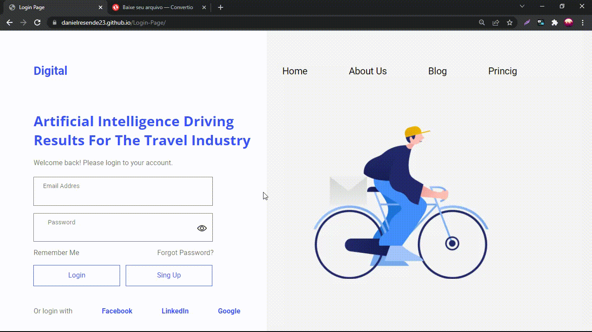

# Página de login
Projeto desenvolvido para praticar novas habilidades de HTML &amp; CSS

## Descrição do Projeto

Projeto desenvolvido com o objetivo de praticar HTML &amp; CSS, usando como base um projeto desenvolvido na community do figma. 

# Projeto 

 Link:  https://danielresende23.github.io/Login-Page/ 

<h1 align="center">
  
  
 
 

</h1>

</h1>
